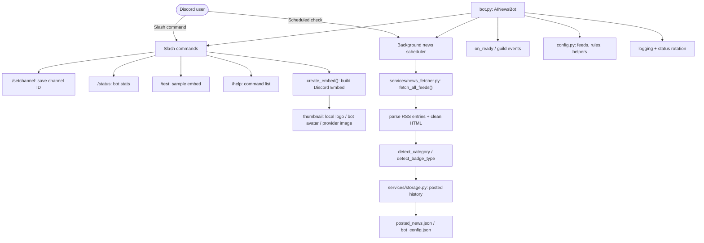

# AI News Discord Bot

A modern Discord bot that tracks AI news, model launches, updates, research, and major announcements from RSS feeds and shares clean embeds in your server.

[](https://discord.com/) [](https://www.python.org/)

---

##  What it does

- Posts AI news automatically from a curated RSS feed list
- Detects model launches, updates, research, APIs, open-source, pricing, and more
- Uses provider branding and local logo support for `/test`
- Avoids duplicate posts with persistent history tracking
- Supports slash commands and legacy text commands

---

##  Quick start

### 1. Clone repository

```bash
git clone https://github.com/rfkisctt/orvyn-ai-news.git
cd orvyn-ai-news-bot
```

### 2. Create virtual environment

**Windows**

```bat
python -m venv venv
venv\Scripts\activate
```

**macOS / Linux**

```bash
python -m venv venv
source venv/bin/activate
```

### 3. Install dependencies

```bash
pip install -r requirements.txt
```

### 4. Configure environment

Create `.env` and add your Discord token:

```env
DISCORD_TOKEN=YOUR_DISCORD_BOT_TOKEN
```

### 5. Start the bot

```bash
python bot.py
```

---

##  Bot setup

1. Create the bot and add it to your Discord server
2. Enable `bot` and `applications.commands`
3. Set the news channel using:

```text
/setchannel
```

---

##  Commands

This bot uses only slash commands. There are no `!` legacy commands in this implementation.

| Command | Description |
|---|---|
| `/setchannel` | Set the channel for auto-posted AI news |
| `/status` | Show bot status and current configuration |
| `/test` | Send a sample news embed with logo support |
| `/help` | Show available bot commands |

---

##  Discord app setup

In the Discord Developer Portal, make sure your bot has the following setup:

1. Under **OAuth2 > URL Generator** select at least 

    These Scopes:
   - `bot`
   - `applications.commands`

    These Bot Permissions:
   - `Send Messages`
   - `Embed Links`
   - `Read Message History`

---

##  Default RSS sources

- OpenAI Blog
- Anthropic Blog
- Google AI / DeepMind
- Meta AI
- NVIDIA Blog
- AWS AI
- Azure AI
- Mistral AI
- Hugging Face Blog
- Stability AI
- Replicate Blog
- LangChain Blog
- xAI News
- Perplexity Blog
- arXiv CS.AI / CS.CL / CS.LG / CS.CV / CS.RO
- TechCrunch AI
- VentureBeat AI
- MIT Technology Review
- MarkTechPost AI

Customize `RSS_FEEDS` in `config.py` to add or change sources.

---

##  Smart detection

The bot uses keyword-driven detection for:

- AI model/brand references
- Release vs update classification
- Category detection like Launch, Update, Research, API, Open Source, Pricing, and more
- Provider logo selection and local `public/return_logo.png` fallback

---

##  Architecture



> [!NOTE]
> The architecture follows this bot project. `bot.py` initializes `AINewsBot`, loads config, syncs slash commands, runs the scheduled news fetch loop, and creates embeds. `services/news_fetcher.py` parses RSS feeds and annotates each item, while `services/storage.py` tracks posted links and saved channel configuration.

---

##  Project structure

```text
orvyn-ai-news-bot/
├── bot.py
├── config.py
├── requirements.txt
├── .env.example
├── public/
│   └── return_logo.png
└── services/
    ├── news_fetcher.py
    └── storage.py
```

### File summary

| File | Purpose |
|---|---|
| `bot.py` | Main bot logic and embed creation |
| `config.py` | Feed definitions, detection rules, config helpers |
| `services/news_fetcher.py` | RSS parsing and news metadata handling |
| `services/storage.py` | Local persistence for posted items |
| `public/return_logo.png` | Local logo asset for `/test` embeds |

---

##  Configuration

Use `.env` to override defaults:

| Variable | Default | Description |
|---|---|---|
| `DISCORD_TOKEN` | — | Discord bot token (required) |
| `NEWS_CHANNEL_ID` | `0` | Default news channel ID |
| `CHECK_INTERVAL_MINUTES` | `5` | Auto-check interval in minutes |
| `MAX_ITEMS_PER_POST` | `5` | Max articles per auto post |
| `MAX_ITEMS_PER_COMMAND` | `10` | Max articles returned by commands |

---

##  Legal

- [Terms of Service](TERMS_OF_SERVICE.md)
- [Privacy Policy](PRIVACY_POLICY.md)

This project is open for personal and development use. Keep attribution intact when reusing or sharing the code.
